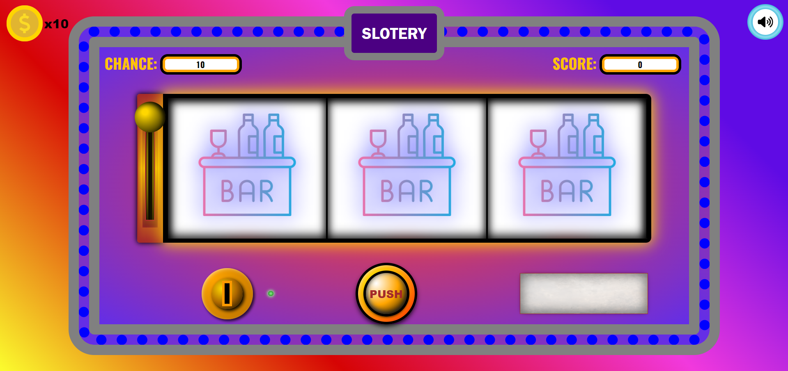

# Slotpot - Slot Machine Game

## Overview
Slotpot is an interactive slot machine game built with HTML, CSS, and JavaScript. The game mimics a traditional slot machine, allowing users to spin the reels and try their luck to win points. The game features sound effects, animations, and a mute button to enhance the user experience.

## Features
- **Interactive Slot Machine:** Spin the reels and win points based on matching icons.
- **Sound Effects:** Includes coin insertion, spinning, and winning sounds.
- **Visual Effects:** Animated coin insertion and spinning reels.
- **Mute Button:** Toggle sound on and off.
- **Chances Counter:** Keeps track of remaining chances to play.
- **Scoreboard:** Displays the current score.
- **Responsive Design:** Adaptable to different screen sizes.

## Technologies Used
- **HTML** for structuring the game interface.
- **CSS** for styling and animations.
- **JavaScript** for game logic and interactivity.
- **jQuery** for DOM manipulation and custom animations.

## File Structure
```
Slotpot/
│
├── index.html         # Main HTML file
├── style.css          # CSS styles
├── script.js          # JavaScript logic
├── images/            # Directory for image assets
│   ├── bar-table.png
│   ├── bell.png
│   ├── billiard-ball.png
│   ├── champion.png
│   ├── cherry.png
│   ├── club.png
│   ├── cocktail.png
│   ├── crown.png
│   ├── diamond (1).png
│   ├── diamond.png
│   ├── dollar-currency-symbol.png
│   ├── dollar-symbol.png
│   ├── favorite.png
│   ├── flash.png
│   ├── grape.png
│   ├── heart.png
│   ├── horseshoe.png
│   ├── lemon.png
│   ├── palm-leaves.png
│   ├── question.png
│   ├── seven.png
│   ├── spade.png
│   ├── speed-limit.png
│   ├── square-dice.png
│   ├── volume-high-solid.svg
│   ├── volume-xmark-solid.svg
│   └── watermelon.png
├── coin-drop-89601.mp3     # Coin insertion sound
├── click-button-140881.mp3 # Click sound
└── winning-82808.mp3       # Winning sound
```

## Setup and Usage
1. **Clone the Repository:**
   ```bash
   git clone https://github.com/ronak-create/slotpot.git
   cd slotpot
   ```

2. **Open the Game:**
   Open `index.html` in your web browser to start playing the game.

## How to Play
1. **Insert Coin:** Drag and drop the coin into the slot to add a chance.
2. **Push to Spin:** Click the "PUSH" button to spin the reels.
3. **Check Results:** Wait for the reels to stop and see if you've won points.
4. **Mute/Unmute:** Click the speaker icon to toggle sound effects.

## Game Logic
- **Reels Spin:** Each reel stops at a random position.
- **Scoring:** Points are awarded based on the number of matching icons:
  - 1 match: 3000 points
  - 2 matches: 1500 points
  - 3 matches: No points
- **Chances:** The game starts with 10 chances. Each spin uses one chance.

## Customization
- **Images:** You can replace the images in the `images` folder to customize the icons on the reels.
- **Sounds:** Replace the `.mp3` files to change the sound effects.

## Credits
- Icons made by various authors from [Flaticon](https://www.flaticon.com/)
- Sound effects from [FreeSound](https://freesound.org/)

## License
This project is licensed under the MIT License. See the [LICENSE](LICENSE) file for details.

---

Enjoy the game and good luck! If you have any questions or feedback, feel free to contact us at [ronakparmar2428@gmail.com](mailto:ronakparmar2428@gmail.com).
